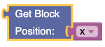
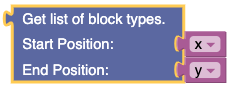
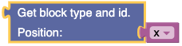
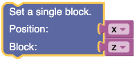
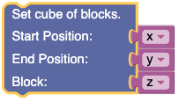

# Getting Started

## Menu bar
###Create your own Script

**File Name**: Enter the name of your script. 

**Naming Exceptions**: Cannot contain the following characters: 

* ? (Question Mark) 

* : (Colon)

* " (Double Quote)

* / (Forward Slash)

* \ (Back Slash)

* | (Veritcal Bar)

* \* (Asterisk)
 
* < (Less Than)

* \> (Greater Than)

##Create Script

### Save and Load Blocks

Save Workspace to file and load Workspace from file

**Save Blocks**: Saves current Workspace to a file.

**Load Blocks**: Loads Workspace from a file.

### Create and Restore Snapshot

Snapshot is all of the blocks in the current Workspace.

**Create Snapshot**: Saves current state of workspace.

**Restore Snapshot**: Restores the previous snapshot and corresponding code. 

## View your Code

To display code created by current block Workspace, click Code tab.

Click Workspace to return to block view.

# Introduction

This is the documentation for the Picrafty API. Each block and its
corresponding python code is documented here.  

This API is based around three classes given in the Raspberry Juice mod used to control the minecraft game world inside Python scripts

1. Minecraft --- Main class for connecting to and interacting with the game.  
2. Player --- Getting and changing a player's position and settings.  
3. Entity --- Getting and changing an entity's position and settings.  

This documentation is a spin-off of documentation for Raspberry Juice found at: **https://www.stuffaboutcode.com/p/minecraft-api-reference.html**  

# Minecraft

## Get Block
Retrieve block type located at Position variable

## Get Blocks
Get all block IDs ranging from one position to another

## Get Block Type and ID
Get the block Type and corresponding ID

## Set Block
Sets a block at a Position variable to a particular type

## Set Blocks
Set many blocks at a time, filling the gap between 2 sets of Position variables

## Get Height
Find the y(vertical) of an x, z coordinate which represents the highest (non-air) block.

## Get Player Entity IDs
Get the entity IDs of the players connected to the game.

## Get Player ID
Get the entity ID of a player

## Post to Chat
Writes the message to the chat window

 

# Player

## Get Player's Position

Outputs player's current position.

## Set Player's Position
Change player's current location to a new position

### Input
 Position variable
 

## Get Tile Position
Output: Position of tile coordinates.

## Set Tile Position
Input: Position variable

## Get Player's Rotation
Output: Rotation angle as float

## Get Player's Pitch
Output: Pitch angle as float

## Get Player's Direction
Output: Player direction as Position variable

# Position

# Entity

## Get Entity's Position
Input: Entity ID (can get using mc.getPlayerIds())

## Set Entity's Position
Input: Entity ID (can get using mc.getPlayerIds())

* Position variable

## Get Position of Tile Underneath Entity
Input: Entity ID

Output: Position variable of the tile that an entity is on

## Set New Position Underneath Entity
Input: 
* Entity ID

* Position variable

## Get Entity's Rotation
Input: Entity ID

Output: Entity rotation angle

## Get Entity's Pitch
Input: Entity ID

Output: Entity Pitch Angle

## Get Entity's Direction
Input: Entity ID

Output: Position variable of entity direction

# Block

## Modify Block
Input: Takes block variable

Output: New block type

